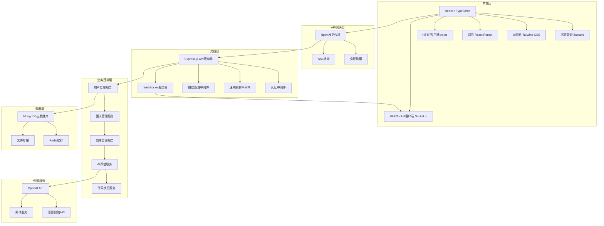
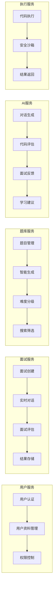
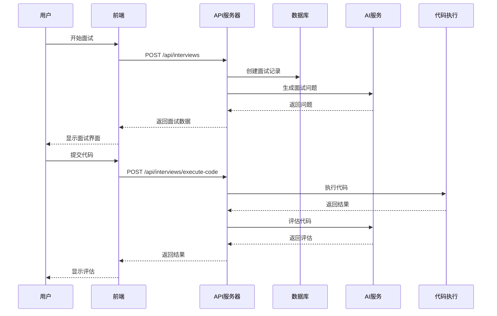
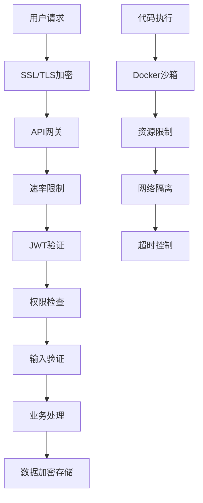
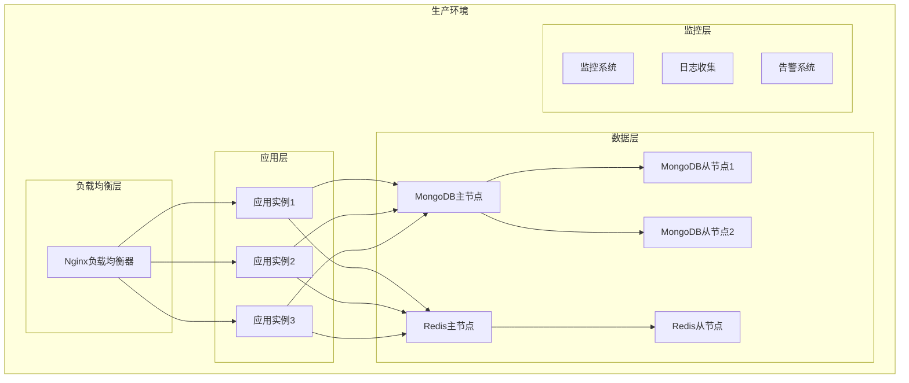

# AI面试助手 - 系统架构文档

## 1. 整体架构图



## 2. 微服务架构



## 3. 数据流架构



## 4. 技术栈架构

### 前端技术栈
```
React 18.x
├── TypeScript 5.x
├── Vite 5.x (构建工具)
├── Tailwind CSS 3.x (样式框架)
├── React Router 6.x (路由)
├── Zustand 4.x (状态管理)
├── React Query (数据获取)
├── React Hook Form + Zod (表单验证)
├── Socket.io Client (实时通信)
├── Monaco Editor (代码编辑)
└── Axios (HTTP客户端)
```

### 后端技术栈
```
Node.js 18.x
├── TypeScript 5.x
├── Express.js 4.x (Web框架)
├── Socket.io 4.x (WebSocket)
├── MongoDB + Mongoose (数据库)
├── Redis (缓存)
├── JWT (认证)
├── OpenAI API (AI服务)
├── Docker (代码执行)
├── Winston (日志)
└── Jest (测试)
```

## 5. 安全架构



## 6. 部署架构



## 7. 数据库设计

### 用户表 (users)
```javascript
{
  _id: ObjectId,
  username: String,
  email: String,
  password: String, // 加密存储
  profile: {
    firstName: String,
    lastName: String,
    avatar: String,
    bio: String,
    experience: String, // junior, mid, senior, lead, principal
    targetRoles: [String],
    targetCompanies: [String],
    resumeUrl: String
  },
  preferences: {
    language: String, // zh-CN, en
    timezone: String,
    notifications: {
      email: Boolean,
      push: Boolean,
      interviewReminders: Boolean,
      progressUpdates: Boolean
    },
    interviewSettings: {
      defaultDuration: Number,
      defaultDifficulty: String,
      defaultInterviewType: String,
      voiceEnabled: Boolean,
      cameraEnabled: Boolean
    }
  },
  subscription: {
    plan: String, // free, premium, enterprise
    status: String, // active, cancelled, expired
    startDate: Date,
    endDate: Date,
    features: [String]
  },
  createdAt: Date,
  updatedAt: Date
}
```

### 面试表 (interviews)
```javascript
{
  _id: ObjectId,
  userId: ObjectId,
  type: String, // technical, behavioral, system-design, coding
  category: String, // algorithms, data-structures, system-design
  difficulty: String, // easy, medium, hard
  questions: [ObjectId], // 题目ID数组
  duration: Number, // 面试时长(分钟)
  status: String, // scheduled, in-progress, completed, cancelled
  score: Number, // 总分
  feedback: {
    overallScore: Number,
    technicalScore: Number,
    communicationScore: Number,
    problemSolvingScore: Number,
    strengths: [String],
    weaknesses: [String],
    recommendations: [String],
    detailedFeedback: String
  },
  transcript: [{
    timestamp: Number,
    speaker: String, // interviewer, candidate
    content: String,
    type: String // speech, code, action
  }],
  recordingUrl: String,
  createdAt: Date,
  updatedAt: Date,
  completedAt: Date
}
```

### 题目表 (questions)
```javascript
{
  _id: ObjectId,
  title: String,
  description: String,
  category: String,
  difficulty: String,
  type: String, // coding, multiple-choice, short-answer, essay
  tags: [String],
  timeLimit: Number,
  points: Number,
  hints: [String],
  solution: {
    explanation: String,
    code: Map, // 不同语言的解决方案
    timeComplexity: String,
    spaceComplexity: String,
    approach: String
  },
  testCases: [{
    input: Mixed,
    expectedOutput: Mixed,
    description: String
  }],
  companies: [String],
  frequency: Number, // 出现频率
  createdAt: Date,
  updatedAt: Date
}
```

## 8. API设计规范

### RESTful API端点

#### 认证相关
```
POST   /api/auth/register          # 用户注册
POST   /api/auth/login             # 用户登录
POST   /api/auth/refresh-token     # 刷新Token
GET    /api/auth/profile           # 获取用户信息
PUT    /api/auth/profile           # 更新用户信息
POST   /api/auth/change-password   # 修改密码
```

#### 面试相关
```
GET    /api/interviews             # 获取面试列表
POST   /api/interviews             # 创建面试
GET    /api/interviews/:id         # 获取面试详情
POST   /api/interviews/:id/start   # 开始面试
POST   /api/interviews/:id/complete # 完成面试
POST   /api/interviews/:id/pause   # 暂停面试
POST   /api/interviews/:id/resume  # 恢复面试
POST   /api/interviews/:id/cancel  # 取消面试
POST   /api/interviews/execute-code # 执行代码
POST   /api/interviews/evaluate-code # 评估代码
GET    /api/interviews/stats       # 获取统计数据
```

#### 题目相关
```
GET    /api/questions              # 获取题目列表
GET    /api/questions/:id          # 获取题目详情
POST   /api/questions              # 创建题目
PUT    /api/questions/:id          # 更新题目
DELETE /api/questions/:id          # 删除题目
GET    /api/questions/random       # 获取随机题目
POST   /api/questions/generate     # 生成题目
GET    /api/questions/categories   # 获取分类列表
GET    /api/questions/tags         # 获取标签列表
```

### WebSocket事件

#### 面试室事件
```javascript
// 客户端发送
{
  event: 'join-interview',
  data: { interviewId: String }
}

{
  event: 'voice-data',
  data: { interviewId: String, audioData: Buffer, language: String }
}

{
  event: 'chat-message',
  data: { interviewId: String, message: String, type: String }
}

{
  event: 'code-change',
  data: { interviewId: String, code: String, language: String }
}

// 服务端发送
{
  event: 'ai-response',
  data: { transcript: String, response: String, timestamp: Number }
}

{
  event: 'code-change',
  data: { userId: String, code: String, language: String, timestamp: Number }
}

{
  event: 'interview-event',
  data: { userId: String, event: String, payload: Object, timestamp: Number }
}
```

## 9. 性能优化策略

### 前端优化
- **代码分割**: 使用React.lazy和Suspense进行路由级别的代码分割
- **缓存策略**: React Query缓存API响应数据
- **图片优化**: 使用WebP格式和懒加载
- **Bundle优化**: Vite构建优化，Tree Shaking
- **CDN加速**: 静态资源CDN分发

### 后端优化
- **数据库索引**: MongoDB复合索引优化查询
- **Redis缓存**: 热点数据缓存，减少数据库压力
- **连接池**: MongoDB连接池管理
- **压缩**: Gzip响应压缩
- **限流**: API请求频率限制

### 系统优化
- **负载均衡**: Nginx upstream负载均衡
- **水平扩展**: 无状态应用设计，支持多实例部署
- **监控告警**: 实时监控系统性能和错误
- **日志管理**: 结构化日志，便于分析和排查

## 10. 监控和运维

### 监控指标
- **系统指标**: CPU、内存、磁盘、网络使用率
- **应用指标**: 请求量、响应时间、错误率
- **业务指标**: 用户活跃度、面试完成率、代码执行成功率
- **数据库指标**: 连接数、查询性能、索引效率

### 日志管理
```javascript
// 日志级别和格式
{
  "timestamp": "2024-01-01T12:00:00.000Z",
  "level": "info",
  "message": "User login successful",
  "userId": "507f1f77bcf86cd799439011",
  "ip": "192.168.1.100",
  "userAgent": "Mozilla/5.0...",
  "requestId": "req-123456",
  "duration": 150
}
```

### 告警规则
- **错误率告警**: 5分钟内错误率超过5%
- **响应时间告警**: 95%请求响应时间超过2秒
- **资源使用告警**: CPU使用率超过80%
- **业务指标告警**: 面试失败率超过10%