# AI面试助手 - 系统设计文档

## 1. 系统架构图

### 1.1 整体架构图

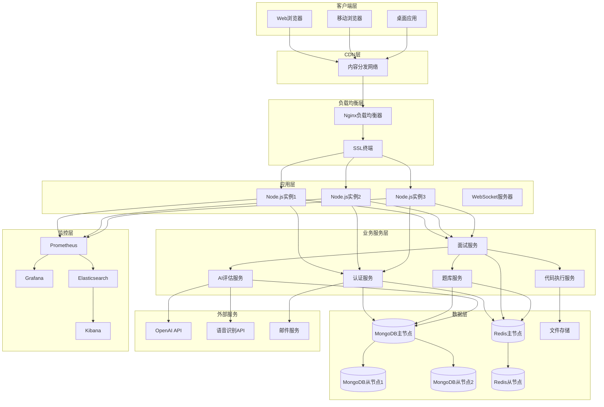

### 1.2 微服务架构图

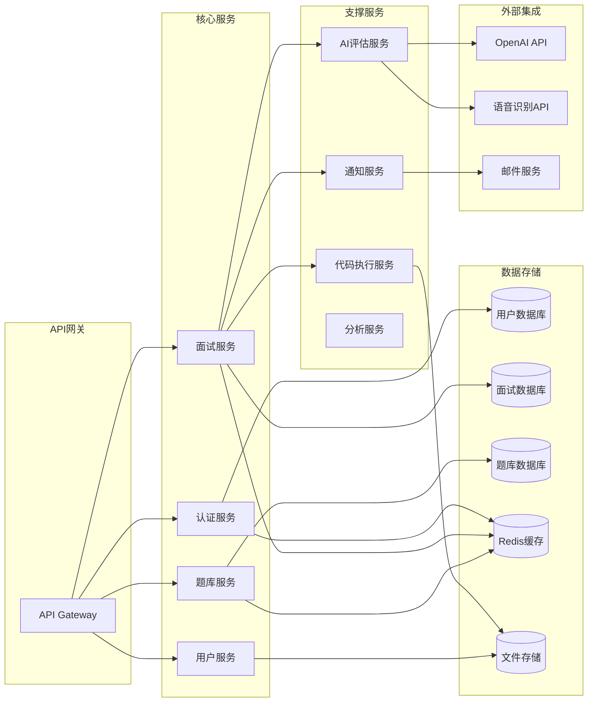

## 2. 数据库设计图

### 2.1 数据模型关系图

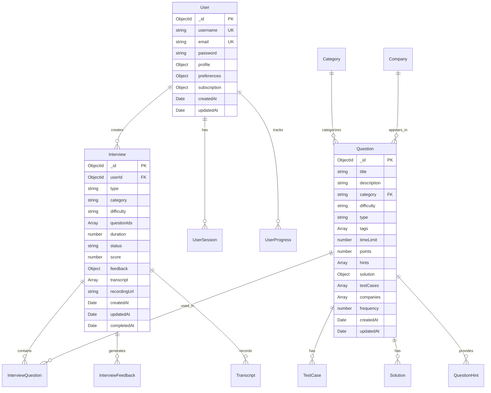

### 2.2 数据流程图

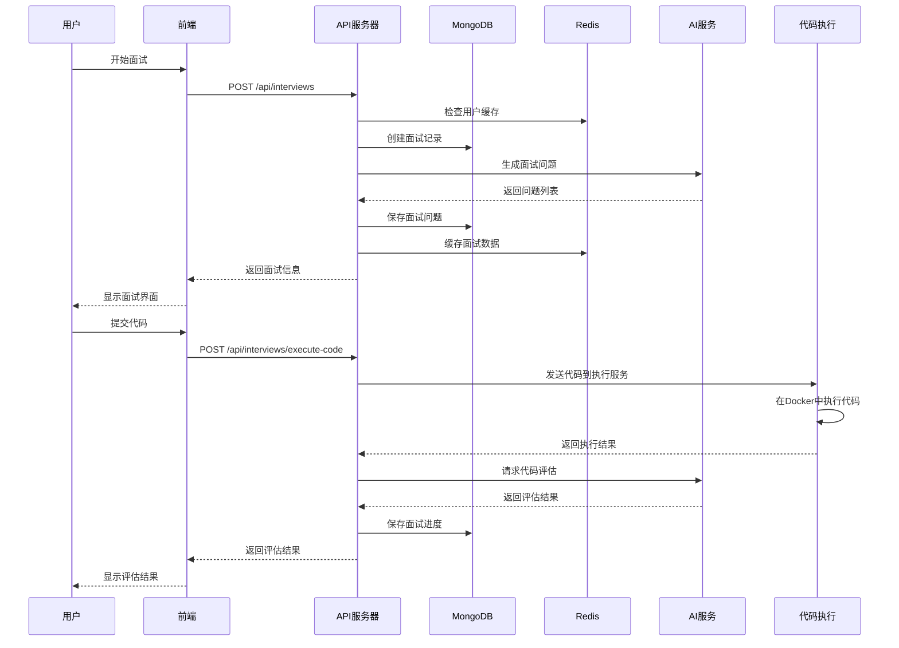

## 3. 安全架构图

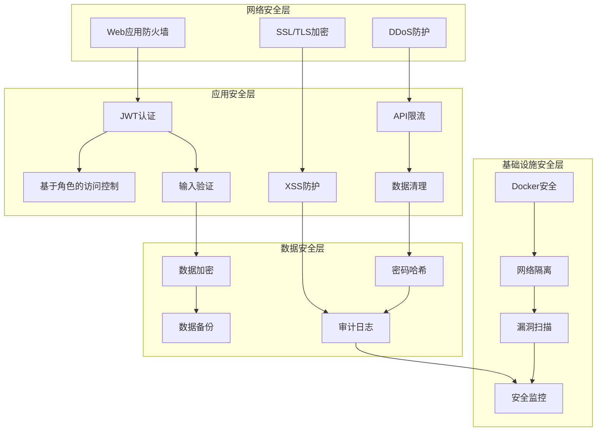

## 4. 部署架构图

### 4.1 生产环境部署架构

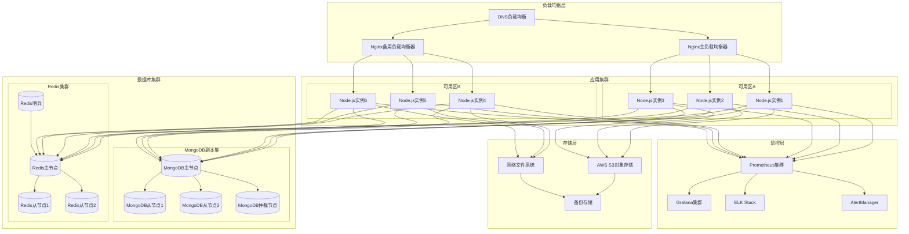

### 4.2 容器化部署架构

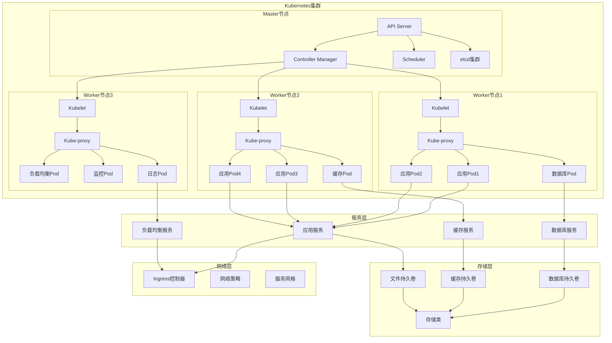

## 5. 技术架构图

### 5.1 前端技术架构

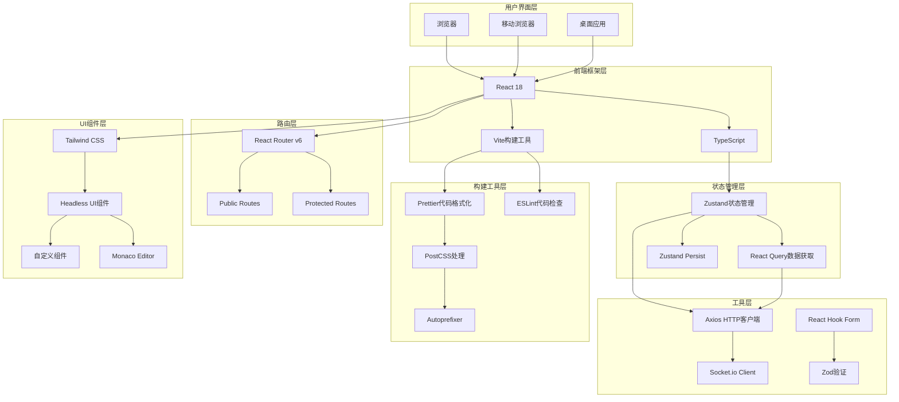

### 5.2 后端技术架构

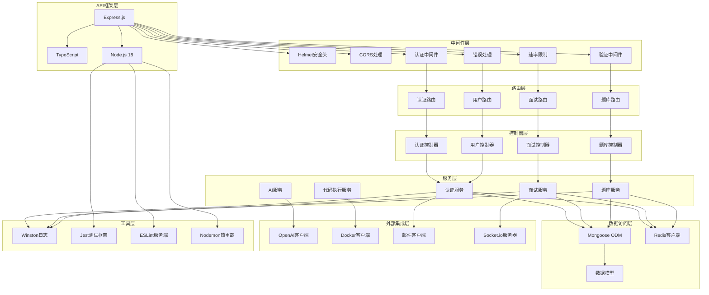

## 6. 业务流程图

### 6.1 用户面试流程图

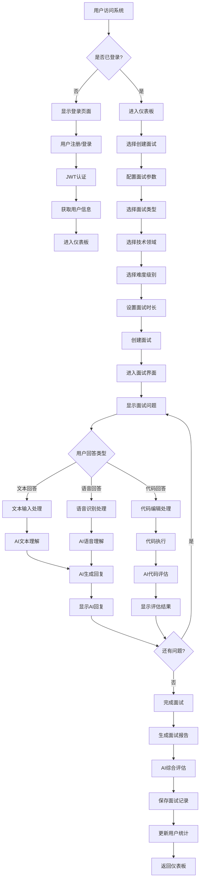

### 6.2 AI评估流程图

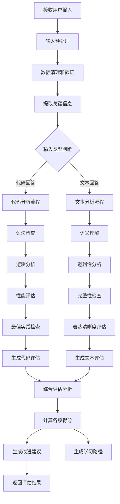

## 7. 系统集成图

### 7.1 第三方服务集成

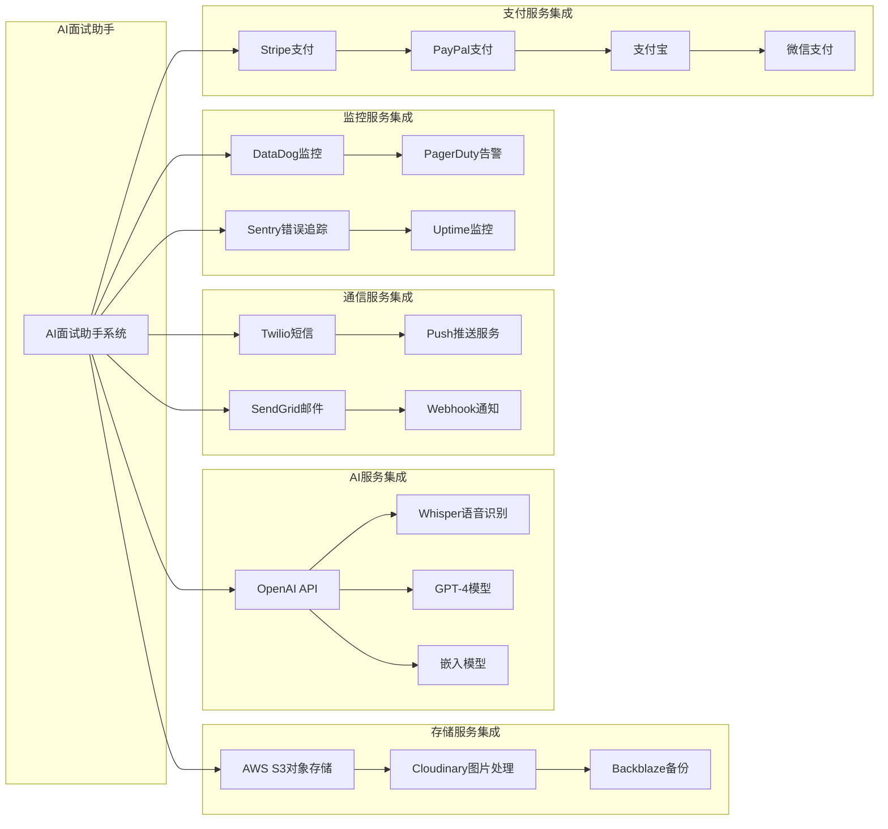

这个设计文档提供了完整的系统架构、数据库设计、安全架构、部署架构、技术架构、业务流程和系统集成的详细图表和说明，为系统的开发、部署和运维提供了全面的指导。